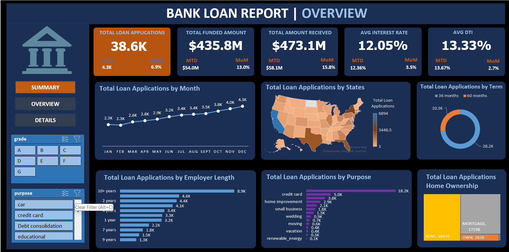
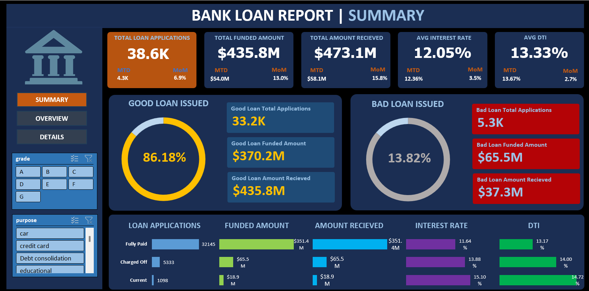

# Bank Loan Analysis

## Project Overview

This project analyzes a bank's loan data to uncover trends, performance metrics, and risk factors. The analysis is visualized through interactive Excel dashboards and is powered by SQL queries for data aggregation and transformation.

## Files

- **Bank Loan Analysis.xlsx**  
  Contains interactive dashboards and charts summarizing the bank loan data.
- **SQL Queries for the Data.sql**  
  Collection of SQL queries used to extract, aggregate, and analyze the loan data.
- **Data/financial_loan.csv**  
  The main dataset containing detailed records of loan applications and statuses.
- **Problem Statement.docx**  
  The project description and objectives (binary file, not included in this summary).
- **Visualizations Images**
  Folder Contains the Images of Charts.

## Data Dictionary

The main dataset (`financial_loan.csv`) includes the following columns:

- `id`: Unique loan identifier
- `address_state`: State of the applicant
- `application_type`: Type of application (individual/joint)
- `emp_length`: Length of employment
- `emp_title`: Job title of the applicant
- `grade`: Loan grade (A-G)
- `home_ownership`: Home ownership status (RENT, OWN, MORTGAGE)
- `issue_date`: Date the loan was issued
- `last_credit_pull_date`: Last date of credit pull
- `last_payment_date`: Last payment date
- `loan_status`: Status (Fully Paid, Current, Charged Off)
- `next_payment_date`: Next scheduled payment date
- `member_id`: Member identifier
- `purpose`: Purpose of the loan (car, credit card, debt consolidation, etc.)
- `sub_grade`: Sub-grade of the loan
- `term`: Loan term (36 or 60 months)
- `verification_status`: Income verification status
- `annual_income`: Annual income of the applicant
- `dti`: Debt-to-income ratio
- `installment`: Monthly installment amount
- `int_rate`: Interest rate
- `loan_amount`: Amount funded
- `total_acc`: Total number of credit accounts
- `total_payment`: Total payment received

## Analysis Performed

- **Loan Application Trends:** By month, state, term, employer length, and purpose.
- **Loan Performance:** Good vs. bad loans, funded amounts, payments received, interest rates, DTI.
- **Breakdowns:** By grade, home ownership, and other key factors.
- **KPIs:** Total applications, funded amount, received amount, average interest rate, average DTI, good/bad loan ratios.

## How to Use

1. **Data Preparation:**  
   Use the provided SQL queries to extract and aggregate data from the CSV file as needed.
2. **Visualization:**  
   Open `Bank Loan Analysis.xlsx` to explore the dashboards and charts.
3. **Customization:**  
   Filter by grade, purpose, and other fields in the Excel dashboard for deeper insights.

## Requirements

- Microsoft Excel (for dashboard)
- SQL database (for running queries, if needed)
- Sufficient memory to handle large CSV files

## Sample Visualizations

- **Summary Dashboard:** Key metrics, good/bad loan breakdown, KPIs
- **Overview Dashboard:** Trends by month, state, term, employer length, purpose, home ownership

## Charts

## Credits

- Data and analysis by [Your Name/Team]
- Dashboard and visualizations created in Microsoft Excel

---

*For more details, refer to the SQL queries and explore the Excel dashboard provided in this project.*